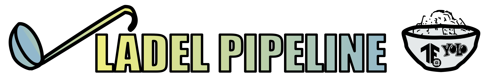

# Ladel Pipeline



Ladel is a TFLite+YOLOV7 enabled labeling and training pipeline built for [First Tech Challenge](<https://www.firstinspires.org/robotics/ftc>)/TF 2.5, usable anywhere.

- [Ladel Pipeline](#ladel-pipeline)
  - [Note](#note)
  - [Installation](#installation)
  - [Labeling](#labeling)
    - [Labeling keys](#labeling-keys)
  - [Training](#training)
  - [Other Files](#other-files)
  - [YOLOV7 Notes](#yolov7-notes)
  - [Implementation](#implementation)
  - [Bugs](#bugs)
  - [Contributing](#contributing)
    - [Some potential areas for improvement](#some-potential-areas-for-improvement)
  - [License](#license)
  - [Press Buttons](#press-buttons)

Ladel is also a misspell of label. To spoon the data into TFLite/YOLOV7

## Note

Most files have a `--help` option for options. Others will simply have information within the file. View [SUFFERING.md](./SUFFERING.md) for the story and why this exists.

## Installation

```bash
git clone https://github.com/PotentialEnergyRobotics/ladel
conda env create --file tf_2_5.yml
conda activate tf_2_5
pip install -r requirements.txt
```

## Labeling

AKA the best part

`python ladel.py`


### Labeling keys

- 'a' key goes back a frame
- 'd' key goes forward a frame
- 'p' key pauses or plays the video
- 'i' key adds new bounding boxes
- 's' key deletes all bounding boxes
- 'q' to close **important** otherwise csv will not save properly
- 'lmb' left mouse deletes a specific bounding box clicked within
- You can purge all the files on each run
- You can start from the last frame saved on each run (to use more than one video)
- Input labels in the console (cannot be a number because of the way tfrecords work)

Tracks your initial box as you play the video, requiring a fraction of the work of other labeling tools.

## Training

- Generate a file containing data with format used by train
  - `python generate_tfrecord.py --csv_input=data/dataset/labels/annotations.csv --output_path=data/tfrecords/train.record --image_dir=data/dataset/images`
- One-shot make your model file! If you run out of memory, decrease the batch size
  - `python train.py`

**Important note:** for GPU training to work with an NVIDIA GPU you must follow the instructions on [Tensorflow's install page](https://www.tensorflow.org/install/pip)
We're really sorry, I know firsthand that this is painful.

There are docker containers, if you'd prefer to take a different route but we have never used those in testing.

## Other Files

- splitter.py
  - used for splitting YOLOV7 data into train and test datasets
- converter.py
  - can currently convert from YOLOV7 format to TFLite format
- tryit.py
  - use the webcam to try out TFLite models (don't expect a decent FPS)

## YOLOV7 Notes

To use this with YOLOV7 instead of TFLite run like this:

```bash
python ladel.py --mode yolov7
python splitter.py --mode yolov7
git clone https://github.com/WongKinYiu/yolov7/
```

You can also convert existing TFLite data (needs to be implemented, good luck)

`python converter.py`

- Follow the README.md instructions in the YOLOV7 repository for setup.
- Copy the data/dataset to the top level of YOLOV7
- Copy one of the files at ./data/ and edit it with the path to your dataset, for val data just make another folder and copy some from test

Then run:

`python train.py --workers 2 --device 0 --batch-size 16 --data data/<youryaml>.yaml --img 640 640 --cfg cfg/training/yolov7-tiny.yaml --weights '' --name tiny-<yourmodel> --hyp data/hyp.scratch.tiny.yaml --epochs 10`

## Implementation

For FTC folks, mostly.

- You need a [Vuforia](https://developer.vuforia.com/) key.
- Plug into your robot controller,  put the generated TFLite file somewhere, and copy the path.
- In Android Studio, copy `FtcRobotController/src/main/java/org/firstinspires/ftc/robotcontroller/external/samples/ConceptTensorFlowObjectDetectionWebcam.java` into your team's code folder
- Remove `@disabled`.
- Change the `LABELS` to your labels.
- Update `TFOD_MODEL_FILE` model to your file path.
- Uncomment `tfod.loadModelFromFile` and comment load from `tfod.loadModelFromAsset`.

## Bugs

Use issues tab to report it, and we'll get to it ASAP.

## Contributing

[Fork it, change it, pull request](https://docs.github.com/en/pull-requests/collaborating-with-pull-requests/proposing-changes-to-your-work-with-pull-requests/creating-a-pull-request-from-a-fork). Or make a feature request in issues tab. I'll get to it ASAP.

### Some potential areas for improvement

- [ ] Improved/advanced labeler
  - [ ] Frame skipping
  - [ ] Label selection with scroll wheel
  - [ ] Other ideas...
- [ ] Write additional help messages and documentation (where needed, such as ladel behavior)
- [ ] Better code, currently practicing anarchy system
- [ ] Graphic design help
- [ ] Better YOLOV7 support
- [ ] Consolidate reused functions (like load labelmap)

For now this is firmly in the pre-alpha state, if you could call it that.

## License

Adding a license is difficult as a significant portion of the code is copied line-for-line, and I'm not a lawyer. I'd say do whatever you want, and the original authors probably won't care but if you really need to be sure just use google.com to search some portion of the code and check whatever comes up for license.

## Press Buttons

Press these buttons... press them... press them ALL

DEW IT

[](https://github.com/PotentialEnergyRobotics/ftc_ladel/watchers)
[](https://github.com/PotentialEnergyRobotics/ftc_ladel/stargazers)
